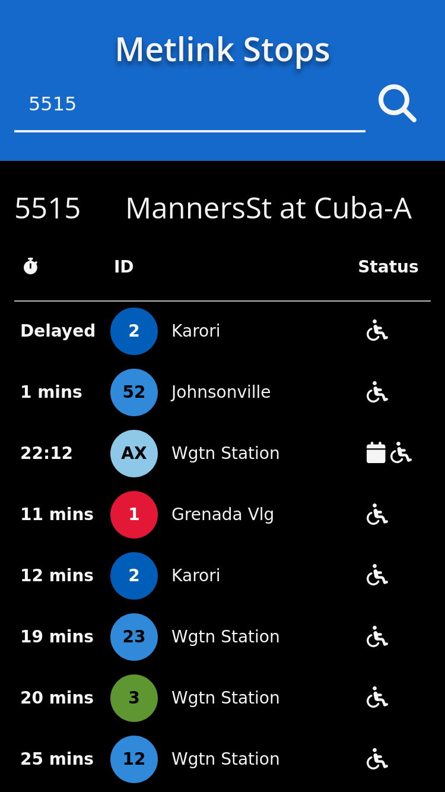

# Metlink Stops

Simple react app that shows stop departures based on stop number/ID



## Backend config
To use backend server, you need to create a JSON config file. An example config file is given below.

```JSON
{
    "baseURL" : "https://api.opendata.metlink.org.nz/v1/stop-predictions?stop_id=",
    "apiKey" : "api-key-here",
    "host": "localhost",
    "port": 8080
}

```

To start backend API server, use command `./api-server.py /path/to/config`.